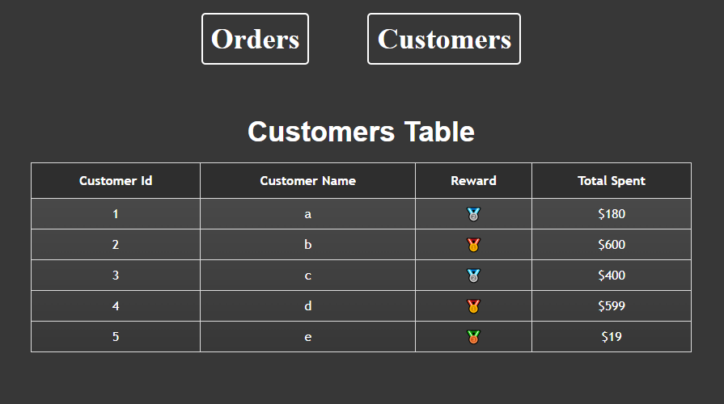
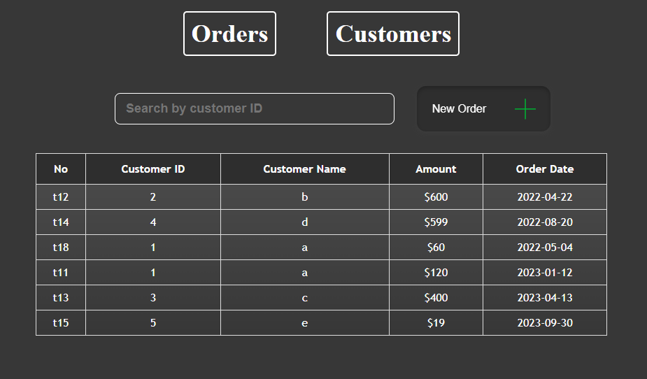
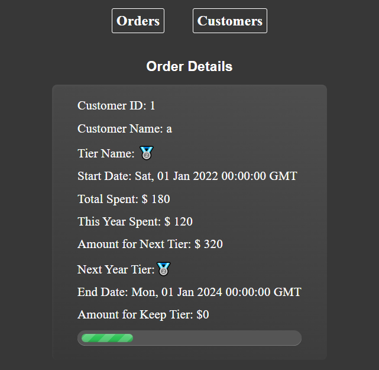

# Tier Client

## Available scripts

In your project directory, you can:

### `yarn install`

### `yarn dev`

Run your app in development mode. \
Open [http://localhost:3000](http://localhost:3000) to view it in your browser.

Editing will reload the page. \
The console also shows lint errors.

### `yarn build`

Build the app for production into the "build" folder. \
Correctly bundle React into production mode and optimize your builds for best performance.

The build will be minified and the filename will include a hash. \
Your app is ready to be deployed.

## Page

###client

### order

### Customer details
